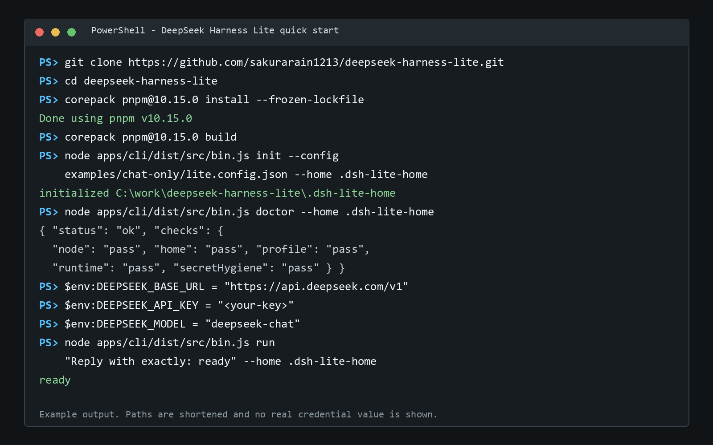

<p align="center">
  
</p>

<h1 align="center">DeepSeek Harness Lite</h1>

<p align="center">
  A lightweight, local-first distribution layer for the official DeepSeek Harness runtime.
</p>

<p align="center">
  <a href="https://github.com/sakurarain1213/deepseek-harness-lite/actions/workflows/ci.yml"></a>
  <a href="LICENSE"></a>
  <a href="https://github.com/deepseek-ai/deepseek-harness"></a>
</p>

> **Unofficial community project.** This repository is independently maintained and is not affiliated with, sponsored by, or endorsed by DeepSeek. The project image is a community-provided asset, not an official project endorsement.

[简体中文](README.zh.md) | [Architecture](docs/architecture.md) | [Plugin authoring](docs/plugin-authoring.md) | [Security](SECURITY.md)

DeepSeek Harness Lite keeps the official Harness agent loop, session model, tool registry, and LLM interfaces. It adds a smaller installation profile, removable capability packs, repository-owned plugins, and reproducible compatibility evidence. It is an independent repository, not a GitHub fork and not a replacement runtime.

## What you are running

| Question | Answer |
| --- | --- |
| Interface | Command-line interface (CLI) |
| Interaction | One task per `run` command; the answer is printed to stdout and the process exits |
| GUI or desktop app | No |
| Interactive chat/REPL | No |
| Supported systems | Windows, macOS, and Linux |
| Current distribution | Native CLI packages: Windows `.zip`/`.exe`, macOS `.tar.gz`/`.dmg`, and Linux `.tar.gz` |

Lite is for users who want a small, inspectable Harness runtime in a terminal or script. It is not currently a graphical chat client.

## Quick start

Download the package for your system from the [latest GitHub Release](https://github.com/sakurarain1213/deepseek-harness-lite/releases/latest). Packaged builds include Node.js and Corepack; you do not need Git, Node.js, or pnpm. The first `init` downloads and validates the exact platform-specific Harness closure, so it needs network access and may take a few minutes. PowerShell 7 (`pwsh`) is needed on Windows only when the `shell` pack is enabled.

### Windows x64

Use the `.exe` installer, open **DeepSeek Harness Lite Terminal** from the Start menu, and run:

```powershell
dsh-lite init --config "$env:LOCALAPPDATA\Programs\DeepSeek Harness Lite\examples\chat-only\lite.config.json" --home "$HOME\.dsh-lite-home"
dsh-lite doctor --home "$HOME\.dsh-lite-home"
```

For the portable ZIP, extract it, open PowerShell in the extracted folder, and use `./dsh-lite.cmd` instead of `dsh-lite`:

```powershell
.\dsh-lite.cmd init --config .\examples\chat-only\lite.config.json --home "$HOME\.dsh-lite-home"
.\dsh-lite.cmd doctor --home "$HOME\.dsh-lite-home"
```

### macOS or Linux

Download the archive matching your CPU (`x64` for Intel/AMD, `arm64` for Apple Silicon), extract it, and enter the extracted directory:

```sh
tar -xzf deepseek-harness-lite-v0.1.1-<platform>-<arch>.tar.gz
cd deepseek-harness-lite-v0.1.1-<platform>-<arch>
./dsh-lite init --config examples/chat-only/lite.config.json --home "$HOME/.dsh-lite-home"
./dsh-lite doctor --home "$HOME/.dsh-lite-home"
```

The macOS `.dmg` contains the same CLI directory as the `.tar.gz`; copy its contents to a writable folder before running `./dsh-lite`. Because the community builds are unsigned, Windows SmartScreen or macOS Gatekeeper may show a warning. Verify the download against `SHA256SUMS.txt`; see [Installation format](#installation-format) for the exact security and signing status.

`init` should print `initialized ...`. `doctor` should return JSON with `"status": "ok"` and every check set to `pass`. Neither command needs a model key.

Commands below use `dsh-lite` for the installed Windows build. For a portable Windows ZIP, use `.\dsh-lite.cmd`; for macOS/Linux, use `./dsh-lite`. Source-checkout users use `node apps/cli/dist/src/bin.js`.

<p align="center">
  
</p>

<p align="center"><em>Example terminal output from the verified flow; paths are shortened and no real credential is shown.</em></p>

### Run the first model task

Set credentials only in the current terminal process. This example uses the official API URL and its common chat model; for another OpenAI-compatible endpoint, use a model name that endpoint actually supports.

Windows PowerShell:

```powershell
$env:DEEPSEEK_BASE_URL = "https://api.deepseek.com/v1"
$env:DEEPSEEK_API_KEY = "<your-key>"
$env:DEEPSEEK_MODEL = "deepseek-chat"
dsh-lite run "Reply with exactly: ready" --home "$HOME\.dsh-lite-home"
```

macOS/Linux:

```sh
export DEEPSEEK_BASE_URL='https://api.deepseek.com/v1'
export DEEPSEEK_API_KEY='<your-key>'
export DEEPSEEK_MODEL='deepseek-chat'
./dsh-lite run 'Reply with exactly: ready' --home "$HOME/.dsh-lite-home"
```

The expected stdout is the model answer, for example `ready`. `DEEPSEEK_BASE_URL` may be an API root ending in `/v1` or the full `/chat/completions` URL. The code default for `DEEPSEEK_MODEL` is `deepseek-v4-flash`; set the variable explicitly when your endpoint uses a different model name. Never put credentials in `lite.config.json`, generated profiles, fixtures, logs, or commits.

## How to use it

1. Run `init` once for a chosen config and Lite home. It resolves, installs, activates, and validates a complete profile before publishing it.
2. Run `doctor` after installation or an update. Continue only when all checks pass.
3. Run `inspect` when you want the exact upstream version, packages, Cordis rows, packs, and plugins in the active profile.
4. Export endpoint credentials in the current terminal.
5. Run one quoted task. The CLI prints the final text and exits; invoke it again for another task.

### Command reference

| Command | Purpose | Needs API credentials |
| --- | --- | --- |
| `init --config <file> --home <dir>` | Build and atomically publish a profile from a JSON config | No |
| `doctor --home <dir>` | Validate Node, home, installed closure, runtime activation, and secret hygiene | No |
| `inspect --home <dir>` | Print the resolved identity, dependency inventory, Cordis rows, packs, and plugins | No |
| `run "<task>" --home <dir>` | Send one task through the active Harness runtime and print the final answer | Yes |

Paths are resolved from the current working directory. `--home` stores generated runtime state; do not edit files inside it by hand. To change capabilities, edit or select a config and rerun `init` against the same home. Publication switches the active profile only after the replacement passes validation.

### Use the developer profile

The included developer profile enables bounded workspace notes, sanitized session export, and the health plugin:

```sh
dsh-lite init --config examples/developer/lite.config.json --home .dsh-lite-home
dsh-lite doctor --home .dsh-lite-home
dsh-lite inspect --home .dsh-lite-home
```

For a custom selection, create a config like this and run `init` with its path:

```json
{
  "schemaVersion": 1,
  "upstream": { "channel": "stable", "version": "0.1.0-rc.6" },
  "profile": "custom",
  "packs": ["workspace", "research"],
  "plugins": ["health"]
}
```

Pack-contributed plugins are added automatically. Do not also list the same plugin in `plugins`; duplicate activation is rejected. Review the capability table below before enabling `shell` or network access.

### Run against another project directory

The current directory becomes the workspace seen by workspace-aware Lite plugins. Keep the CLI and generated home in the cloned Lite repository, then call them with absolute paths from your project:

Windows PowerShell:

```powershell
$LiteRepo = "C:\src\deepseek-harness-lite"
Set-Location "C:\src\my-project"
node "$LiteRepo\apps\cli\dist\src\bin.js" run "Summarize this project" --home "$LiteRepo\.dsh-lite-home"
```

macOS/Linux:

```sh
LITE_REPO="$HOME/src/deepseek-harness-lite"
cd "$HOME/src/my-project"
node "$LITE_REPO/apps/cli/dist/src/bin.js" run 'Summarize this project' --home "$LITE_REPO/.dsh-lite-home"
```

### Common problems

| Message or symptom | Fix |
| --- | --- |
| `Node ^22.19.0 or >=24 is required` | Install a supported Node.js release and rerun `init` |
| `unable to read generated Lite state` | Check `--home`, then run `init` for that home |
| `generated profile is not ready` | Do not repair the generated directory manually; rerun `init` |
| Endpoint or credentials are not configured | Export `DEEPSEEK_BASE_URL` and `DEEPSEEK_API_KEY` in the same terminal that runs the CLI |
| Model returns HTTP 400/404 | Set `DEEPSEEK_MODEL` to a model supported by that endpoint |
| Windows `shell` profile fails its probe | Install PowerShell 7 and confirm `pwsh` is on `PATH` |

## Installation format

Starting with v0.1.1, Release assets are produced and smoke-tested on their native platform:

| System | Assets | Included runtime |
| --- | --- | --- |
| Windows x64 | Portable `.zip`, Inno Setup `.exe` | Node.js 22.19.0 + Corepack |
| macOS Intel | Portable `.tar.gz`, `.dmg` | Node.js 22.19.0 + Corepack |
| macOS Apple Silicon | Portable `.tar.gz`, `.dmg` | Node.js 22.19.0 + Corepack |
| Linux x64 | Portable `.tar.gz` | Node.js 22.19.0 + Corepack |

CI rejects absolute, checkout-bound, escaping, or broken links, moves the deployment away from the checkout, and runs `init`, `doctor`, and `inspect` through the packaged launcher before publishing it. The artifacts include both READMEs, examples, the project image, MIT license, NOTICE, and checksums. They are CLI distributions, not GUI apps or single-file binaries.

The current community builds are **not code-signed**. The Windows installer may trigger SmartScreen. The macOS images are not notarized and may require the user to approve the download in Privacy & Security. Do not bypass a warning before checking the SHA-256 checksum and confirming that the file came from this repository's Release page.

### Build from source

Contributors and unsupported architectures can still build from source. This path requires Git, Node.js `^22.19.0` or `>=24`, and Corepack:

```sh
git clone https://github.com/sakurarain1213/deepseek-harness-lite.git
cd deepseek-harness-lite
corepack pnpm@10.15.0 install --frozen-lockfile
corepack pnpm@10.15.0 build
node apps/cli/dist/src/bin.js init --config examples/chat-only/lite.config.json --home .dsh-lite-home
node apps/cli/dist/src/bin.js doctor --home .dsh-lite-home
```

## What Lite changes

| Area | Lite behavior |
| --- | --- |
| Runtime core | Uses official public DeepSeek Harness packages without copying or patching upstream source |
| Default profile | Installs the text-only `chat-only` closure |
| Optional capability | Adds exact dependency and Cordis rows through removable packs |
| Plugins | Activates only explicitly selected or pack-contributed Lite plugins |
| Compatibility | Pins one verified upstream package set and keeps latest-upstream observation separate |
| Publication | Builds immutable profiles and switches `current.json` only after validation |

## Profiles and capability packs

| Selection | Contents | Typical use |
| --- | --- | --- |
| `chat-only` | Official text runtime; no optional pack or plugin | Minimal chat and API validation |
| `developer` | `workspace` pack by default | Local work with bounded notes and session export |
| `workspace` | `lite_notes` and sanitized session export | Durable project context without generic filesystem/search tools |
| `shell` | Local subprocess, sandbox policy, command allowlist, Bash or PowerShell rows | Explicit local command execution |
| `research` | `lite_safe_fetch` | Bounded public HTTP(S) retrieval without upstream generic `web_fetch` |

Packs are declarative and removable. Changing the selection regenerates the exact dependency closure, lock, and Cordis rows. Disabled capability packages are physically absent from the generated profile.

The v0.1.0 `workspace` pack intentionally excludes upstream generic filesystem and search tools. The `research` pack intentionally excludes upstream generic `web_fetch`. Those broader surfaces remain off until their containment and SSRF boundaries pass the release gate.

## Bundled plugins

| Package | Contribution | Security boundary |
| --- | --- | --- |
| `@dsh-lite/plugin-health` | Sanitized `lite_health` diagnostics | Does not enumerate environment values |
| `@dsh-lite/plugin-safe-fetch` | Bounded public HTTP(S) fetch | Revalidates redirects; blocks private and special-use destinations; limits bytes and time |
| `@dsh-lite/plugin-workspace-notes` | Fixed-path durable notes | Restricts data to `.dsh-lite/notes.md`; checks canonical paths and links; bounds UTF-8 bytes |
| `@dsh-lite/plugin-command-allowlist` | Deny-by-default shell policy | Parses tokens structurally and rejects shell syntax; default rules are read-only |
| `@dsh-lite/plugin-session-export` | Markdown or JSON session projection | Exports an explicit event and field allowlist |

Repository plugins install with the source checkout for static, reviewable imports. Installation does not activate them. A resolved profile mounts only direct selections and contributions from selected packs.

The plugin roadmap favors capabilities with a clear user workflow, public upstream interfaces, narrow authority, deterministic tests, and native Windows/macOS/Linux evidence. The project aims to add more useful plugins over time, but a plugin is bundled or recommended only after its install, build, activation, license, secret, and security-boundary checks pass. External plugins can enter the evidence-based catalog before they are candidates for bundling.

## Plugin catalog

Catalog status is derived from evidence, not from repository topics, popularity, or metadata alone.

| Status | Meaning |
| --- | --- |
| `bundled` | Maintained in this repository and covered by release gates |
| `verified` | An external pinned commit passed the published install, build, activation, license, and risk checks |
| `listed` | Metadata is reviewable, but executable verification is incomplete |
| `blocked` | License, secret, install, build, activation, or safety evidence prevents recommendation |

External submissions must pin a full source commit, declare an SPDX license and Harness compatibility, include install/build/activation evidence, and disclose risk flags. See [Plugin authoring](docs/plugin-authoring.md) and the generated [catalog](catalog/generated/README.md).

## Architecture

```text
lite.config.json
       |
       v
CLI -> resolver -> exact closure + Cordis rows -> immutable profile publication
                    ^                         |
                    |                         v
             capability packs       official Harness runtime
                                              |
                                              v
                                  official tool registry + Lite plugins
```

Lite owns configuration, closure generation, publication, plugins, and evidence. Official packages own the agent loop, sessions, model integration, and tool registry. Read [Architecture](docs/architecture.md) for trust boundaries and the publication protocol.

## Upstream compatibility

The stable channel pins the complete upstream `0.1.0-rc.6` package inventory in [`compat/upstream-lock.json`](compat/upstream-lock.json). Generated closures and locks cover every pack combination on Windows, macOS, and Linux.

The v0.1.0 release evidence and all five bundled plugin records are bound to Lite source commit `573e77a16e58d9832f6dca282cac00f1dbde2cea`. The later evidence commit records generated results without changing that verified source.

Compatibility is **best-effort and release-gated**, not permanent:

- stable uses the exact upstream release that passed the recorded gates;
- the latest-upstream workflow only detects new registry metadata;
- an upstream update requires regenerated closures and locks plus the complete release gates;
- Lite config and pack schemas remain stable where practical;
- incompatible upstream changes are handled through migration notes and versioned releases.

The maintenance target is to evaluate each coherent official Harness release promptly and publish a matching Lite patch or minor release after regenerated closures, plugins, runtime behavior, and the complete native CI matrix pass. If an upstream version fails, Lite keeps the last verified stable set and documents the blocker instead of claiming untested compatibility. This is an active best-effort synchronization policy, not a same-day compatibility guarantee.

See [Upstream maintenance](docs/upstream-maintenance.md).

## Windows support

Windows is a supported v0.1.0 platform. The native path uses PowerShell rows, Windows package closures, PATHEXT-aware probes, and final-path profile construction so pnpm absolute junctions remain valid. `current.json` changes only after the candidate passes validation.

The release gate includes a native regression named `keeps a native Windows absolute junction valid after publication`. Windows is part of the same release-blocking CI matrix as Ubuntu and macOS; it is not configured with `continue-on-error`. Local validation also covers `init`, `doctor`, `inspect`, a real OpenAI-compatible API turn, profile cleanup, secret scanning, and all five plugins.

See [Windows support](docs/windows-roadmap.md) for the exact gates and platform requirements.

## Install-size evidence

The committed clean measurement was recorded on Windows x64 with Node.js `24.12.0` and pnpm `10.15.0`. It is one-platform evidence, not a universal size promise.

| Installation | Bytes | Files | Installed packages | Direct dependencies | Workspaces |
| --- | ---: | ---: | ---: | ---: | ---: |
| Lite checkout with build/test dependencies | 144,713,749 | 4,234 | 121 | 64 | 14 |
| Generated `win32-chat-only` closure | 2,443,233 | 372 | 20 | 18 | N/A |
| Official `@deepseek-ai/dsh@0.1.0-rc.6` aggregate | 257,006,438 | 32,696 | 523 | 1 | N/A |

[`compat/reports/install-size.json`](compat/reports/install-size.json) is the source of truth. Run `corepack pnpm@10.15.0 measure:install` again whenever the dependency graph or measurement method changes.

## Security and maintenance

- Credentials stay in process environment variables; diagnostics redact secret-like fields.
- Generated profiles use exact dependencies, committed lock hashes, and profile-local resolution checks.
- Optional packs expand authority and must be selected explicitly.
- Network, filesystem, process, and session plugins enforce separate narrow boundaries.
- A valid Lite configuration is not a sandbox. Review enabled packs and plugins before running untrusted tasks.

Report vulnerabilities through GitHub private vulnerability reporting as described in [SECURITY.md](SECURITY.md). Do not include real keys or private logs.

## Contributing and license

See [CONTRIBUTING.md](CONTRIBUTING.md) for code, pack, documentation, and catalog changes. Original Lite code is available under the [MIT License](LICENSE). Upstream and third-party packages retain their own copyrights and licenses; see [NOTICE.md](NOTICE.md).

"DeepSeek" and "DeepSeek Harness" identify the upstream project. Their use here does not imply affiliation, sponsorship, or endorsement.
